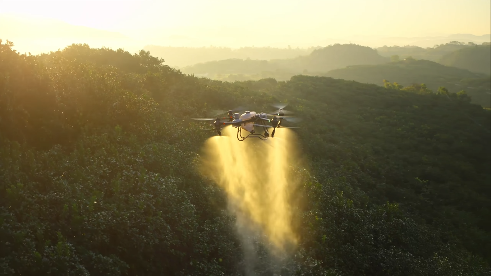

# 🚁 AGROVANT: drone agrícola

Landing page de venda de um **drone inteligente para agricultura e silvicultura**, feita durante o curso para praticar HTML e CSS.



## Seções do site

- **Hero com vídeo de fundo** em reprodução automática e chamada para demonstração
- **Vídeos e reportagem** com links para o YouTube
- **Benefícios do produto**: monitoramento aéreo em tempo real, aplicação localizada de defensivos, redução de custos, cobertura de grandes áreas e relatórios automatizados
- **Depoimentos** de clientes
- **Formulário de agendamento** de demonstração (nome, celular e e-mail)

## Tecnologias

- HTML5 (com `<video>` de fundo)
- CSS3 com **layout responsivo** (media query para telas menores)
- Google Fonts (Cal Sans, Inter e Roboto)

## Estrutura

```
├── index.html
├── style.css
└── assets/img/
    ├── Logo.png
    ├── Imagem 3.jpg
    ├── Imagem 4.jpg
    └── mp4/         # vídeos de fundo
```

## Como rodar

Não precisa instalar nada:

1. Clone o repositório
   ```bash
   git clone https://github.com/julio-aurelio/venda_de_drone.git
   ```
2. Abra o `index.html` no navegador.

---

Feito por **Julio Aurelio Souza** 😼
